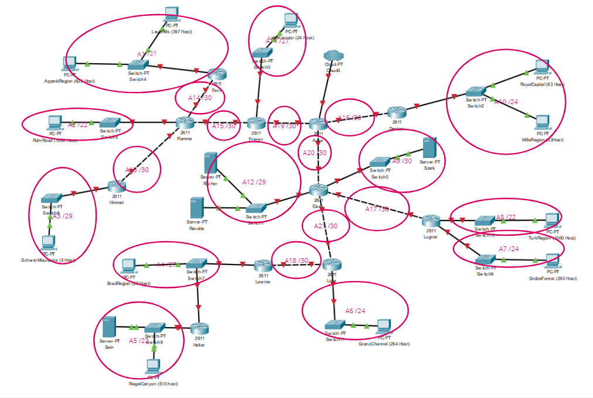
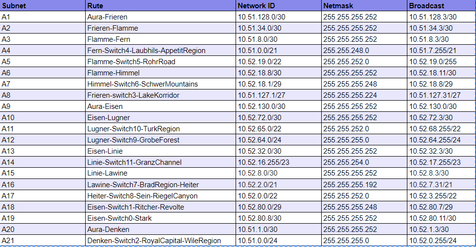
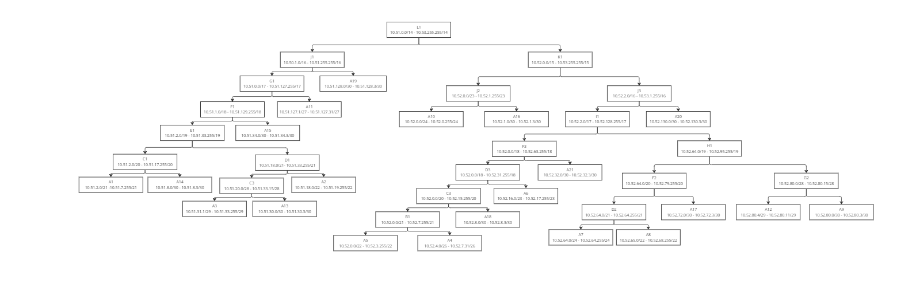
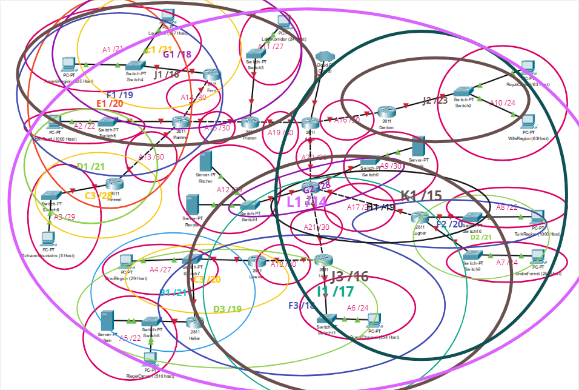
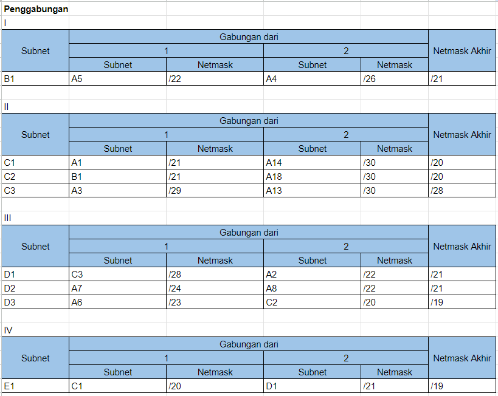
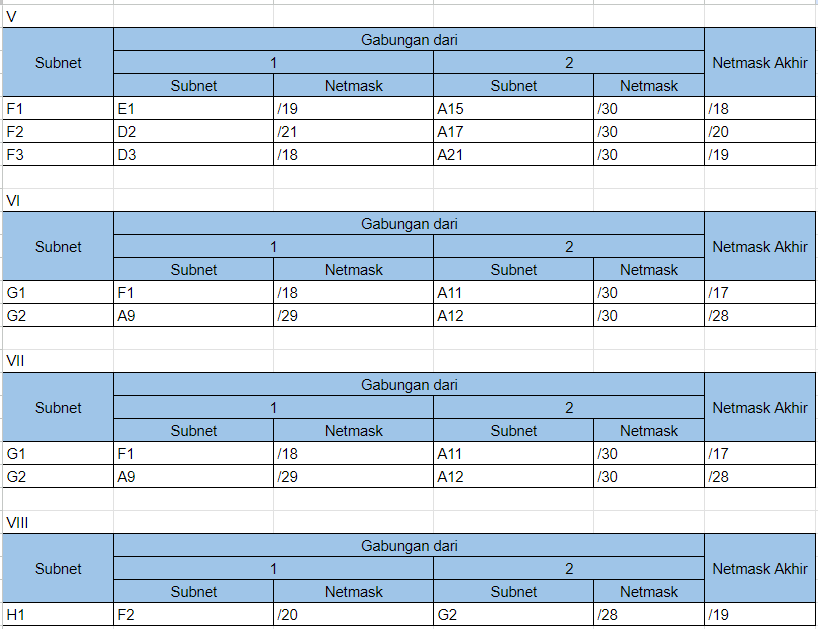
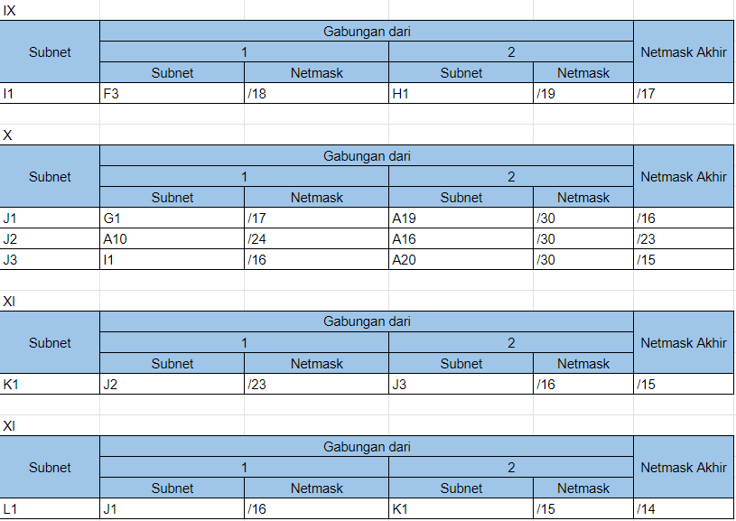
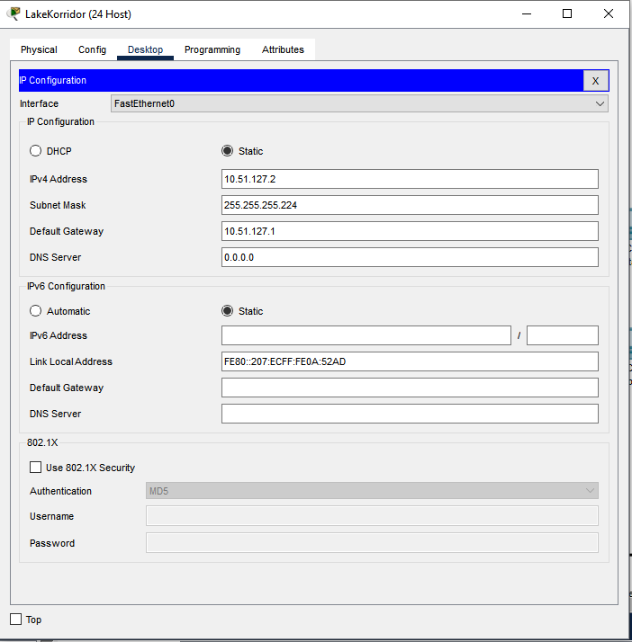
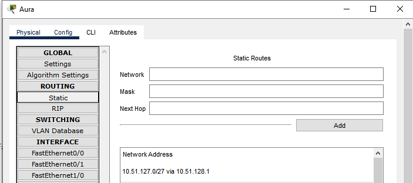
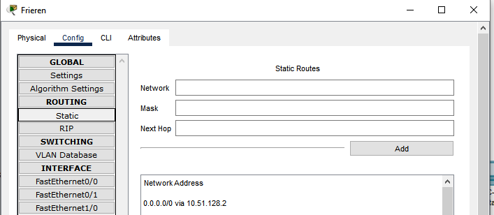

# Laporan Praktikum Modul 4 Jaringan Komputer

| Kelompok | Nama | NRP |
|----------|------|-----|
| F01      |Alfa Fakhrur Rizal Zaini|5025211214|

# Topologi

- Pengerjaan CIDR menggunakan Cisco Packet Tracer
- Pengerjaan VLSM menggunakan GNS3 Virtual Machine

# CIDR
Pembagian IP dari metode CIDR dapat dilihat melalui gambar berikut:

## Subnetting
### Pembagian IP

### Tree

### Klasifikasi

### Penggabungan IP

## Routing
### How to
Proses routing dapat dilakukan dengan mengkonfigurasi :

router - bagian Routing
Server dan Client - bagian Desktop -> IP Configuration.
Sebagai contoh untuk Routing IP router Frieren ke Client Lake Korridor

#### LakeKorridor

Maka dari itu, kita perlu setting frieren untuk mendengarkan dari aura dan setting aura untuk melakukan nexthop ke frieren ketika ingin mengakses LakeKorridor atau client yang se-subnet dengan melakukan routing ke network id milik LakeKorridor

### Aura

### Frieren

Settingan tersebut dijalankan pada semua router agar client dapat diakses oleh router / client luar
